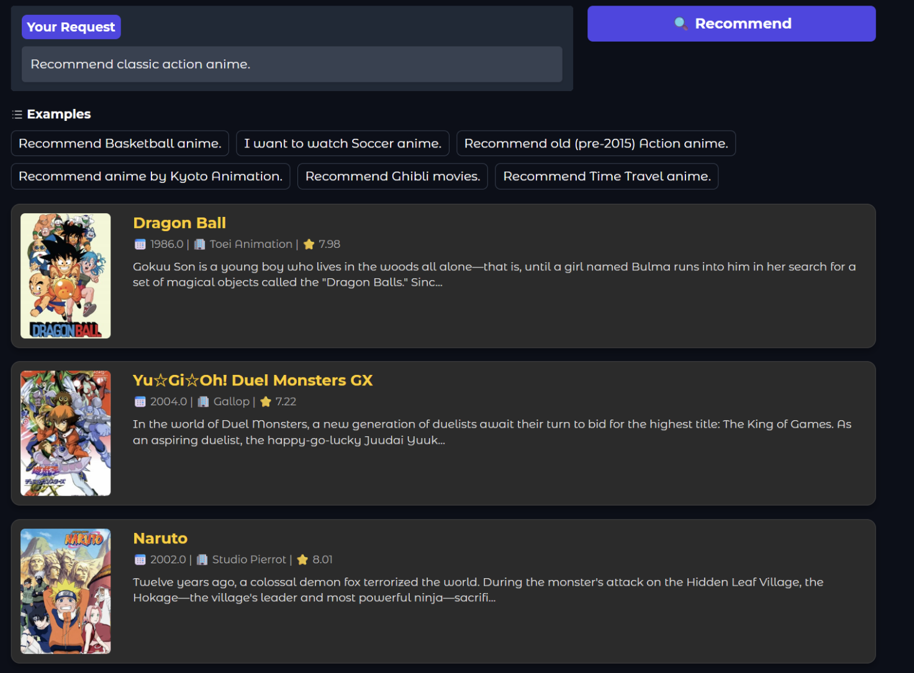

# Anime LLM Recommender (Generative AI Final Project)
## Overview

This is an anime recommendation system that combines Large Language Model (LLM) fine-tuning with retrieval technologies. Developed as a final project for a Generative AI course, this system is designed to eliminate common issues found in standard LLMs, such as hallucinations (recommending non-existent titles) and unstable output formats.

## Demo



## Core Features

  * **Hybrid SFT & RAG Architecture**: Utilizes Supervised Fine-Tuning (SFT) to train the model to output recommendations in a strict JSON List format. It then applies Retrieval-Augmented Generation (RAG) to fetch factual anime metadata (scores, release years, descriptions, and images) from a local database, ensuring 100% accuracy in the provided details.
  * **Hidden Tag Mining**: Overcomes the limitations of broad, generic categories (e.g., "Sports"). The system extracts granular hidden tags from synopsis texts, enabling specific searches for categories like Basketball, Soccer, Time Travel, Cyberpunk, and Ghibli-Style.
  * **Quality Filtering**: During the data preprocessing stage, the system automatically filters out obscure works with fewer than 500 favorites. This guarantees that the recommended anime maintain a baseline level of popularity and relevance.
  * **Hardware Optimized (4-bit Quantization)**: Leverages `bitsandbytes` to quantize the model into NF4 format, drastically reducing memory consumption. The model can be trained and executed on a single consumer-grade GPU, such as an RTX 3080 Ti (12GB VRAM).

## System Architecture

1.  **Base Model**: Employs `meta-llama/Llama-3.2-3B-Instruct` for its lightweight footprint and strong instruction-following capabilities.
2.  **Fine-Tuning Method**: Uses LoRA (Low-Rank Adaptation) targeting the Attention Layers of the Transformer architecture (r=16, alpha=32).
3.  **Retrieval & UI Layer**: Once the model generates a JSON array of titles, a Python-based search engine matches them against the local CSV database. Matches are rendered into clean HTML cards via a Gradio web interface.

## Installation & Setup

1.  **Install Dependencies**:
    Ensure you have the required packages installed in your Python environment. You can install them via the provided requirements file:

    ```bash
    pip install -r requirements.txt
    ```

2.  **Prepare Dataset**:
    Download the "MyAnimeList Anime Dataset 2025" from Kaggle. Place the `mal_anime.csv` file directly into the root directory of this project.

3.  **Hugging Face Authentication**:
    Since this project utilizes Meta's Llama 3.2 model, you must have access granted on Hugging Face. Run the following command in your terminal and enter your token:

    ```bash
    huggingface-cli login
    ```

## Usage Instructions

Execute the following scripts sequentially to prepare the data, train the model, and launch the web application:

### Step 1: Data Preparation

This script reads `mal_anime.csv`, cleans the data, applies the popularity filter, mines hidden tags, and generates a 10,000-sample conversational dataset (`train_selector_v13_fav.jsonl`) for SFT.

```bash
python 1_prepare_data.py
```

### Step 2: Model Training

Reads the generated dataset and fine-tunes Llama 3.2 using QLoRA. The trained LoRA weights and the training loss curve will be automatically saved in the `./llama3.2_sft_v13` directory.

```bash
python 2_train.py
```

### Step 3: Launch Application

Loads `mal_anime.csv` as the RAG database and mounts the trained LoRA adapter. Executing this script will provide a local link to open the Gradio web UI.

```bash
python 3_app.py
```

## Project Structure

  * `1_prepare_data.py`: Data cleaning, tag mining, and dataset generation script.
  * `2_train.py`: LoRA supervised fine-tuning and learning curve plotting script.
  * `3_app.py`: Front-end application script integrating the Gradio UI with Python retrieval logic.
  * `requirements.txt`: Python environment dependencies.
  * `.gitignore`: Git ignore configuration.
  * `docs/`: Directory containing project reports (PDF format) and the UI demonstration image.

## Development Team

Yu-Xiang Yang, Heng-Zhen Lin, En-Shuo Chan, Ching-Ling Chung.
